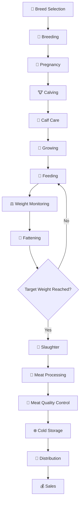

# 🥩 Meat Production Workflow

The beef production cycle covers breeding, calf development, growing, feeding, fattening, processing and sales.

## Main Stages

### 1. Breed Selection
Selection of breeds according to meat production objectives and farm conditions.

### 2. Breeding
Selection and breeding of animals for beef production.

### 3. Pregnancy
Management of pregnant cows and preparation for calving.

### 4. Calving
Birth and initial care of the calf.

### 5. Calf Care
Early nutrition, health monitoring and housing.

### 6. Growing
Development of the animal and monitoring of growth performance.

### 7. Feeding
Providing balanced nutrition according to the animal's growth stage.

### 8. Weight Monitoring
Regular monitoring of body weight and average daily gain.

### 9. Fattening
Final feeding period focused on achieving the required market weight and meat characteristics.

### 10. Slaughter
Processing of animals after reaching the required production parameters.

### 11. Meat Processing
Processing and preparation of meat products.

### 12. Meat Quality Control
Quality and safety control of the produced meat.

### 13. Cold Storage
Temperature-controlled storage before distribution.

### 14. Distribution
Transportation of meat products to customers, retailers or other destinations.

### 15. Sales
Sale and distribution of beef products.