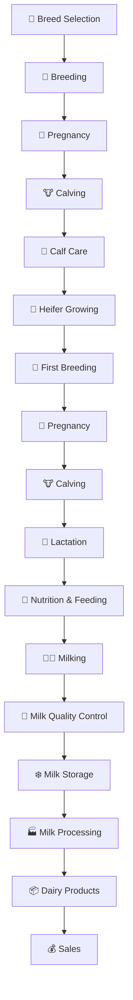

# 🥛 Milk Production Workflow

The milk production cycle covers the process from breeding and calf development to milk production, processing, storage and sales.

## Main Stages

### 1. Breed Selection
Selection of cattle breeds according to milk production goals, climate, farm conditions and production system.

### 2. Breeding
Breeding management and selection of animals for reproduction.

### 3. Pregnancy
Monitoring the cow during pregnancy and preparing for calving.

### 4. Calving
Birth of the calf and post-calving care of the cow.

### 5. Calf Care
Initial calf care, colostrum feeding, nutrition, housing and health monitoring.

### 6. Heifer Growing
Development of young female cattle until reproductive maturity.

### 7. First Breeding
First reproductive cycle and breeding of the heifer.

### 8. Lactation
Milk production following calving.

### 9. Milking
Collection of milk using manual or automated milking systems.

### 10. Milk Quality Control
Monitoring milk quality, hygiene and composition.

### 11. Milk Storage
Cooling and temporary storage before processing or transportation.

### 12. Milk Processing
Processing raw milk into dairy products.

### 13. Sales
Distribution and sale of milk and dairy products.