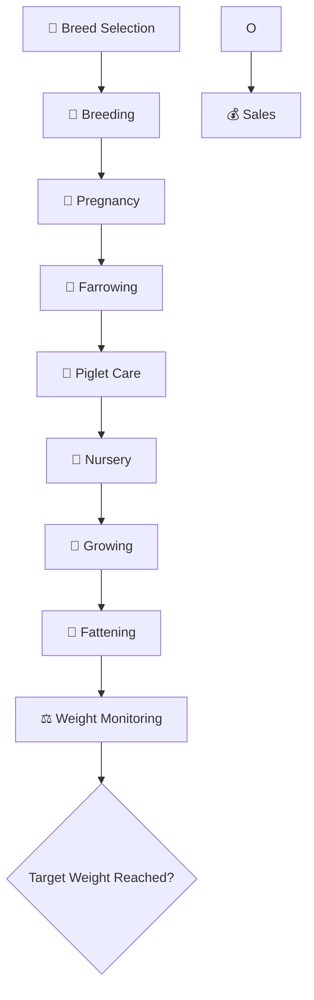

# Pigs workflow structure

# 🐖 Pig Production Workflow

```mermaid
flowchart TD
    A[🐖 Breed Selection] --> B[🧬 Breeding]
    B --> C[🤰 Pregnancy]
    C --> D[🐷 Farrowing]
    D --> E[🍼 Piglet Care]
    E --> F[🌱 Nursery]
    F --> G[🌾 Growing]
    G --> H[🍖 Fattening]
    H --> I[⚖️ Weight Monitoring]
    I --> J{Target Weight Reached?}
    O --> P[💰 Sales]
```